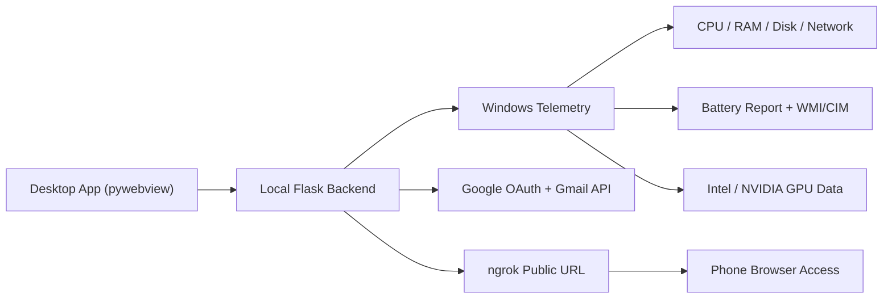

# Device Health Monitor

Device Health Monitor is a Windows desktop application for live laptop health monitoring, Google sign-in, Gmail alerts, battery diagnostics, and phone access through `ngrok`.

It combines a hidden local Flask backend with a desktop shell built using `pywebview`, then packages everything into a standalone Windows EXE, a portable ZIP, and a setup installer.

## Highlights

- Live monitoring for CPU, GPU, RAM, disk, battery, and network
- Stable dual-GPU display for Intel and NVIDIA adapters
- Battery health data from `powercfg` plus live Windows battery details
- Google OAuth sign-in inside the desktop workflow
- Gmail alerts from the signed-in Google account
- Phone/browser access through a configured `ngrok` URL
- Dark/light dashboard theme
- Windows EXE, setup installer, and portable build flow

## Tech Stack

| Layer | Tools |
| --- | --- |
| Desktop shell | `pywebview`, `pystray`, `Pillow` |
| Backend | `Flask` |
| Telemetry | `psutil`, Windows WMI/CIM, `powercfg`, `nvidia-smi` |
| Auth & mail | Google OAuth, Gmail API |
| Packaging | `PyInstaller`, PowerShell, IExpress |

## Architecture



## Core Features

### 1. Live System Dashboard

The main dashboard refreshes every 2 seconds and presents:

- CPU utilization with a steadier rolling sample
- GPU usage with fixed adapter placement so the Intel/NVIDIA cards do not jump positions
- RAM and disk usage
- Battery charge, battery health, and report-based capacity details
- Network upload/download rates
- Recent history charts for CPU, GPU, RAM, battery, disk, and battery health

### 2. Battery Diagnostics

Battery information is built from two sources:

- Live Windows battery state
- Parsed `powercfg /batteryreport` output

This lets the app show:

- battery percentage and charge state
- estimated runtime / charge completion
- design capacity and full-charge capacity
- health percentage and wear
- manufacturer / chemistry / serial details when available

### 3. Google Sign-In and Gmail Alerts

The app supports Google login through a web client configuration and can send alert emails from the signed-in Gmail account.

Alert controls currently include:

- CPU threshold
- RAM threshold
- alert check interval
- cooldown window
- test email

### 4. Phone Access Through ngrok

If you set a public HTTPS URL in `public_base_url.txt`, the app can:

- generate a QR code
- open the same dashboard on a phone browser
- keep Google sign-in working over the public `ngrok` domain

## Project Structure

```text
app.py                         Flask backend, telemetry, auth, alerts
desktop_app.py                 Desktop launcher and ngrok orchestration
templates/                     Active UI templates
installer/                     Setup / uninstall scripts
build_portable.ps1             Portable folder + ZIP builder
DeviceHealthMonitor.spec       PyInstaller definition
requirements.txt               Python dependencies
google_oauth_client.example.json
public_base_url.txt            Placeholder ngrok config
```

## Requirements

- Windows 10 / 11
- Python 3.10+
- Microsoft Edge WebView2 Runtime
- Optional: `ngrok`
- Optional: `nvidia-smi` for richer NVIDIA GPU details

## Local Development

```powershell
python -m venv venv
venv\Scripts\activate
pip install -r requirements.txt
python desktop_app.py
```

## Google OAuth Setup

1. Copy `google_oauth_client.example.json` to `google_oauth_client.json`
2. Fill in your Google OAuth **web** client values
3. Add this redirect URI in Google Cloud:

```text
http://127.0.0.1:5000/auth/google/callback
```

If you also use `ngrok`, add:

```text
https://YOUR-NGROK-DOMAIN
https://YOUR-NGROK-DOMAIN/auth/google/callback
```

Google requires exact origin and redirect URI matching.

## ngrok Setup

1. Start the app so Flask is running on port `5000`
2. Start `ngrok`

```powershell
ngrok http 5000
```

3. Put your reserved HTTPS URL into `public_base_url.txt`
4. Restart the app if needed

## Build

### Build EXE

```powershell
venv\Scripts\activate
python -m PyInstaller --noconfirm --clean DeviceHealthMonitor.spec
```

Output:

```text
dist\DeviceHealthMonitor.exe
```

### Build Portable Package

```powershell
powershell -ExecutionPolicy Bypass -File .\build_portable.ps1
```

Output:

```text
dist_portable\DeviceHealthMonitor-Portable
dist_portable\DeviceHealthMonitor-Portable.zip
```

### Build Setup Installer

```powershell
powershell -ExecutionPolicy Bypass -File .\installer\build_installer.ps1
```

Output:

```text
dist\DeviceHealthMonitorSetup.exe
```

## Runtime Data

During source runs, runtime files are kept under `runtime/` so the repo stays clean.

Typical runtime data includes:

- logs
- Google auth state
- battery report cache
- notification settings
- generated local secrets

Installed builds store user data under the local app-data folder, while portable builds keep runtime files next to the EXE.

## Security Notes

- `google_oauth_client.json` is intentionally not committed
- the repo only includes `google_oauth_client.example.json`
- `public_base_url.txt` is a placeholder and should be changed locally
- Google OAuth redirect URIs must match your actual localhost / ngrok setup

## Attribution

See [ATTRIBUTIONS.md](ATTRIBUTIONS.md) for third-party attribution notes.
